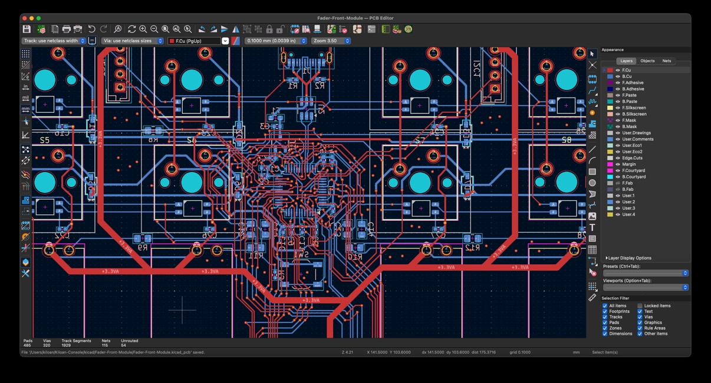
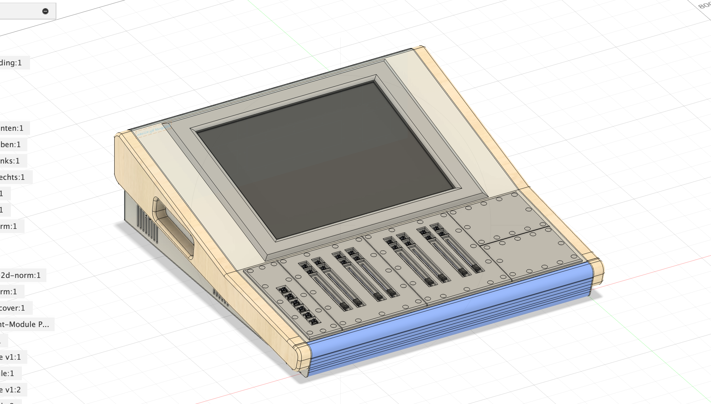
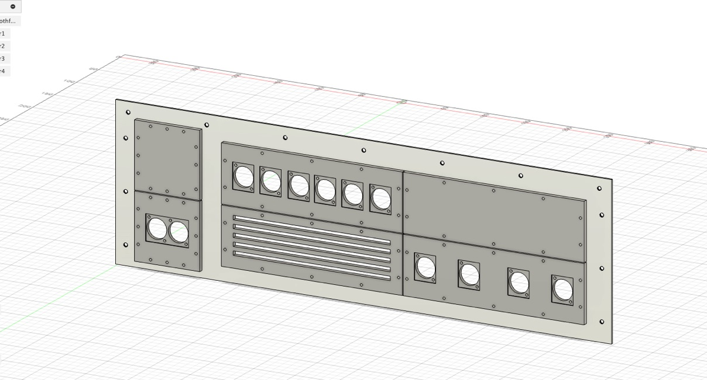

  <h1 align="center">Kiloan Desk</h1>

  .png)

  

  <a href="https://blueprint.hackclub.com/">
    </img>
  </a>
  

  <h1></h1>
  

    A customizable mixing console like high quality chassis system for building your own console systems.
  

This work is licensed under the
[MIT License](https://mit-license.org).

## Table of Contents

- [About](#about)
- [Pictures](#pictures)
- [Bill of Materials](#bill-of-materials)

# About

I have a dream: a self-designed system where everyone can build the perfect mixing console/video console/DIY whatever console out of Aluminum Sheet Metal and a bit of the best hoppyist in house fabrication, 3d printing! And that's why I did this project, it's adapted somewhat to my current wishes and needs, but it can be individually adapted and replicated by anyone without breaking the budget.

# Pictures

# Bill of Materials

<strong>Show Bill Of Materials(BOM) ----></strong>

|Part Name                                                       |Quantity                                    |Price            |Vendor                                                 |Shipping Cost                                    |Total Cost       |Link(if applicable)                                                                                                                                                                                                                                                             |
|----------------------------------------------------------------|--------------------------------------------|-----------------|-------------------------------------------------------|-------------------------------------------------|-----------------|--------------------------------------------------------------------------------------------------------------------------------------------------------------------------------------------------------------------------------------------------------------------------------|
|Misc Front Module PCBs + Stencil                                |1x5                                         |€9.35            |jlcpcb                                                 |                                                 |                 |                                                                                                                                                                                                                                                                                |
|Fader Front Module PCBs + Stencil                               |1x5                                         |€16.58           |jlcpcb                                                 |                                                 |                 |                                                                                                                                                                                                                                                                                |
|Deck Switcher Front Module PCBs + Stencil                       |1x5                                         |€10.71           |jlcpcb                                                 |Shipping for all 3 PCB orders: €47.18            |                 |                                                                                                                                                                                                                                                                                |
|LCSC Electronic Components for 1x Deck Switcher/2x Fader/2x Misc|1 Order for everything(see lcsc cart export)|€87,81           |lcsc                                                   |€9,37                                            |                 |                                                                                                                                                                                                                                                                                |
|Keyswitches for the PCBs                                        |3x10pcs                                     |€5,20            |aliexpress                                             |€0                                               |                 |https://de.aliexpress.com/item/1005006814061416.html?spm=a2g0o.cart.0.0.639b4ae4hJRiNj&mp=1&pdp_npi=5%40dis%21EUR%21EUR%201.75%21EUR%201.75%21%21EUR%201.75%21%21%21%4021038da617652205559805350e63e4%2112000038390782462%21ct%21DE%216411673618%21%213%210&gatewayAdapt=glo2deu|
|M5x10mm Screws                                                  |3x100pcs                                    |€7,08            |schraubenking-shop.de(local and cheapest in my country)|                                                 |                 |https://www.schraubenking-shop.de/M5-x-10mm-Linsenkopfschrauben-TX-ISO14583-Edelstahl-A2-P004399                                                                                                                                                                                |
|M3x10mm Screws                                                  |1x100pcs                                    |€1,98            |schraubenking-shop.de(local and cheapest in my country)|Shipping for everything from schraubenking: €5,84|                 |https://www.schraubenking-shop.de/M3-x-10mm-Linsenkopfschrauben-TX-ISO14583-Edelstahl-A2-P004381                                                                                                                                                                                |
|JLCCNC Sheet Metal Parts                                        |10 individual parts                         |€146.97          |jlccnc                                                 |€78.28                                           |                 |jlccnc.com                                                                                                                                                                                                                                                                      |
|Estimated Total                                                 |                                            |€285,68 ($335,30)|                                                       |€140.67 ($165,15)                                |€426,35 ($500,56)|                                                                                                                                                                                                                                                                                |

